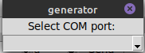
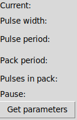
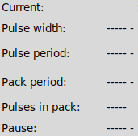
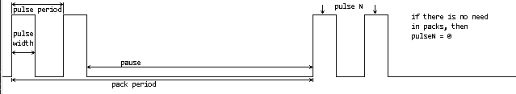
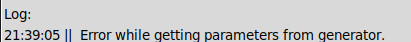
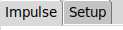

### generator  [OnHold]

#### Description device:  
The pulse generator, implemented on STM32, can generate:  
1. continuous pulse generation;  
2. generation of pulse bursts.  

Init mode:
- width - 1 us;  
- period - 10 us;  
- pack period - 100 us;  
- number of impulses - 5.  

Max number of impulses in package - 2048.  
Min pulse width 100 ns.  
Control from a computer via RS-232 (J8) interface or via UART-USB adapter (J6).  
The development of the device is suspended, the plans are:  
- firmware for analog channel;  
- saving data to a separate EEPROM (scheme and firmware);  
- new version of the case.  

#### PC program description:
The program allows you to customize the set values for the generator.  
For use:  
- linux: run generator_pyGui.py  
- windows: run dist/generator_pyGui.exe  
Setup:  
1. Select the COM port to which the device is connected from the drop-down list:  
  
2. By default, the generator runs in init mode. The current parameters are  
written in the current field. By pressing the button "Get parameters" you can  
get the current set values.  
  
If there is no data exchange with the generator, then there will be dashes in  
this field, there will also be errors in the log field.  
  
3. The generator parameters are set in order, that is, the pulse duration and  
its period, the burst period (set in any case, even if not needed), the number  
of pulses are set separately, if the number of pulses is 0, then there will be  
a constant generation of pulses, without a burst.  
The name of the parameter is signed in the figure:  
  
If something is entered incorrectly, or some other error occurs, everything  
will be displayed in the log field.  
  
4. If the wrong COM port was selected, then you can switch to the "Setup" tab,  
  
select "Disconnect", click "Refresh", select the required COM port from the  
drop-down list, and click the "Connect" button, you can go back to the  
"Impulse" tab.  
The protocol for data exchange between the device and the PC is [here](docs/protocol.html). 

#### Scheme
[scheme_v3.2_pdf](docs/scheme/scheme_v3.2.pdf)